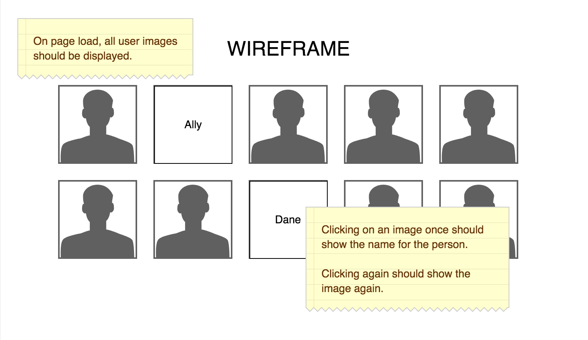

# Angular Photo Gallery

For this activity, you will be dispalying a grid of photos on the page. When a photo is clicked on, the photo should be replaced with a div containing the persons name. Clicking a second time will hide the name of the person.

## Task List

The server has been set up for you and `angular.js` has been sourced in to the HTML. All of the code you write should be in the `client.js` and `index.html` files. **Do not** modify the server code for this assignment.

- [ ] Fork and clone this repository. Run `npm install` and `npm start` to get started.
- [ ] Set up your app with AngularJS using `ng-app`
- [ ] Create a controller for your app using `ng-controller`
- [ ] Bring the provided array of people into your controller scope
- [ ] Repeat over the array of people in your HTML using `ng-repeat`
- [ ] Display the photos using `ng-src` with an image tag
- [ ] Add click handlers to each of your images using `ng-click`
- [ ] Create a JavaScript function that adjusts the visible property of your user object
- [ ] Show the users name when the user is clicked on using `ng-show` or `ng-hide`

## Wireframe

## Stretch Goals

Some of these will be tricky and may require additional research.

- [ ] Display a click counter for each image below the image that tracks the number of times it's clicked
- [ ] Include a link `href` to each persons GitHub page below the image
- [ ] Add a clear button that hides all names
- [ ] Add a search input field at the top of the page that filters the results
- [ ] Add styling to the page
